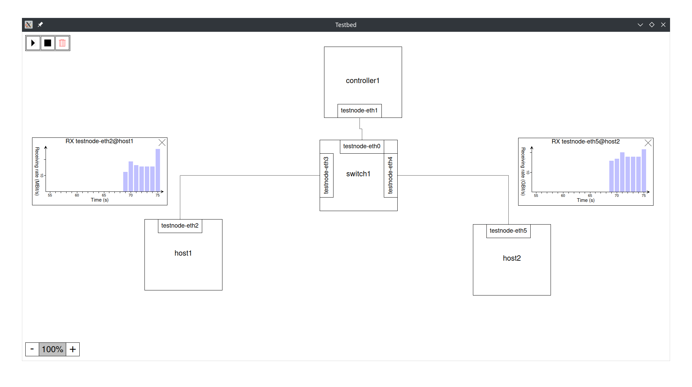

# Testbed

A distributed network testbed featuring ovs, ryu and other hosts in a cluster of lxc enabled hosts.
Focus is on extensibility for the future, option for offline deployment and online-mode (as in mininet/distrinet).



## Requirements

+ Linux with pacman or apt.
  (Installation can still be performed manually for other package managers, if required.)
+ Enough system resources to host lxc containers.

## Terminology

+ Node: A physical computation system that executes services
+ Service: A service running on a node

## Installation

Clone this repository and run the interactive install script:

```bash
sudo ./setup_all.sh
```

This needs to be performed on any node participating in either bootstrapping or deploying services.

To remove all components again, run the uninstall script accordingly:

```bash
sudo ./uninstall_all.sh
```

## Getting started

To get started, have a look at the [examples](examples).
Ready to deploy your first testbed?
Let us generate the topology description (intermediate representation) first.
The general pipeline of the testbed is as follows:

```
Python topology script -> Intermediate representation (json) -> Deployment/Export
```

First, we change workdir to the testbed folder within this repo.

```bash
cd testbed
```

From there, we can now generate the intermediate representation from one of the examples
(in the examples we do not need the optional args):

```bash
./generate_topology.sh ../examples/simple_switch.py [topology args]
```

Now we have multiple options to deploy the testbed on our local node. If you want to deploy
on multiple nodes or another node, you will need to edit the python script or choose offline deployment.

### Exporting via SSH

To export via SSH you need to be able to establish SSH connections to all nodes that
participate in your testbed. You need to setup an ssh daemon on every node and launch
a local ssh agent that authenticates you.

To prepare localhost for ssh as required by most examples one typically has to run:

```bash
ssh-keygen #Save somewhere
cat <PATH_TO_YOUR_PUBKEY> >> /root/.ssh/authorized_keys #You might need to create /root/.ssh before
systemctl start sshd
# The following commands have to be run in every shell you use the testbed from
eval $(ssh-agent)
ssh-add <PATH_TO_YOUR_PRIVATE_KEY>
```

#### Exporting via console

To export/launch via console, use the `remote_topology.sh` script.
To run a command on a remote service, use the `execute_command.sh` script.

For our example, we can deploy by simply running:

```bash
./remote_topology.sh start_all
```

Usage for `remote_topology.sh`:

```bash
./remote_topology.sh <start_all|stop_all|destroy_all>
./remote_topology.sh <start|stop|destroy> <nodes|services>
./remote_topology.sh ping <service1> <service2[:intf]>
./remote_topology.sh iperf <service1> <service2[:intf]> [port] [interval] [time] [<client options> [| <server options>]]
./remote_topology.sh ifstat <service|node> <intf>
./remote_topology.sh <up|down> <service|node> <intf>
./remote_topology.sh setqdisc <service|node> <intf> [<delay(ms)> [<delay-variation(ms)> [<delay-correlation(0;1)> [<loss(0;1)> [<loss-correlation(0;1)>]]]]]
Nodes and services can be prefixed with \"node:\" or \"service:\" to resolve ambiguity."
```

Usage for `execute_command.sh`:

```bash
./execute_command.sh <service_name> <cmd> [args]
```

#### Exporting via GUI

To export/launch the topology via a graphical user interface and get a live overview over
all your services, statistics and more, you can also run:

```bash
./gui.sh [-f|--fullscreen]
```

`-f` and `--fullscreen` are flags to enable full screen.

### Exporting offline

To export scripts that can be run later on any linux system, run:

```bash
./export_topology.sh [export_path]
```

## Credits

Part of this work is inspired or taken from [Distrinet](https://github.com/Giuseppe1992/Distrinet).
As these parts are interleaved with our code base, they are not specifically marked but acknowledged here.
This mainly applies to the service definitions for ryu and ovs.

## Authors

+ Fritz Windisch

## License

TBA